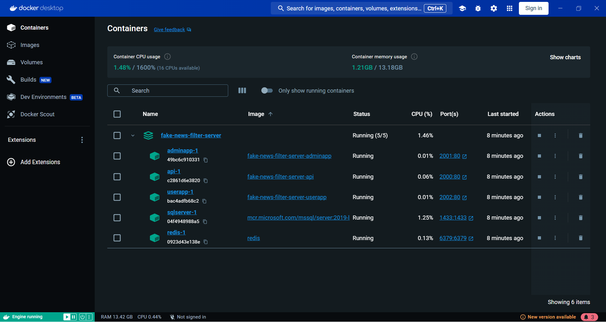
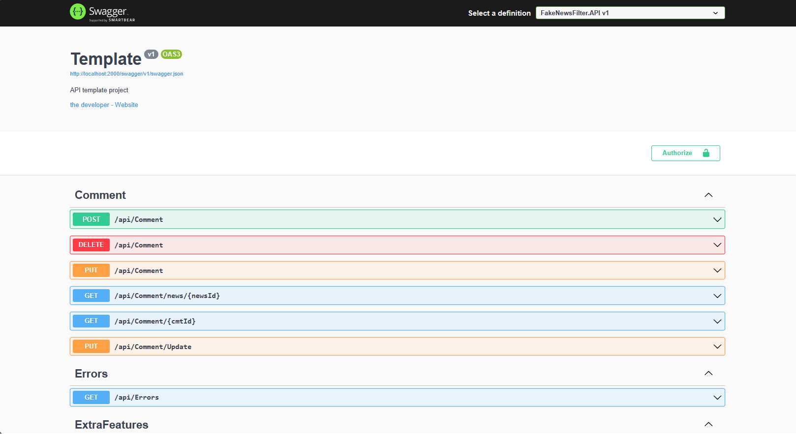
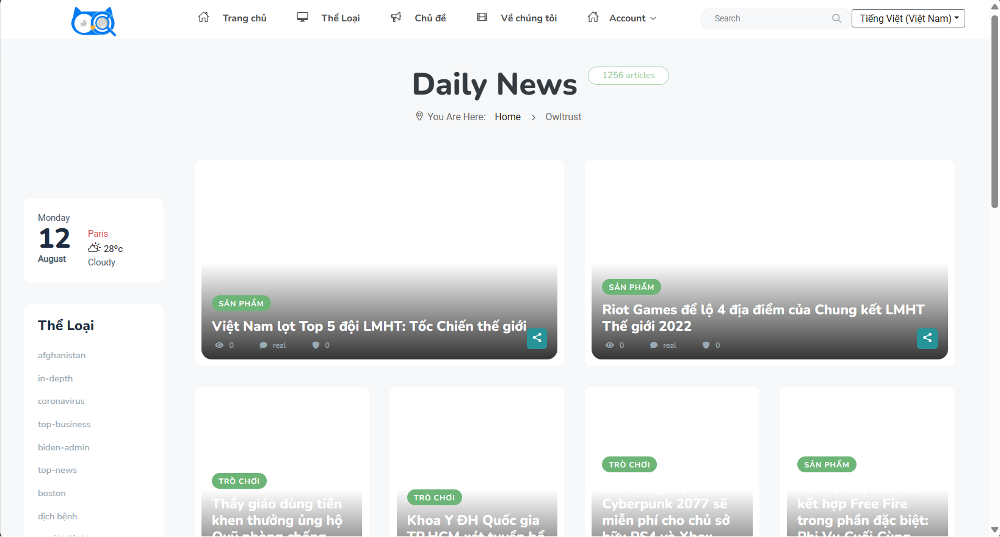
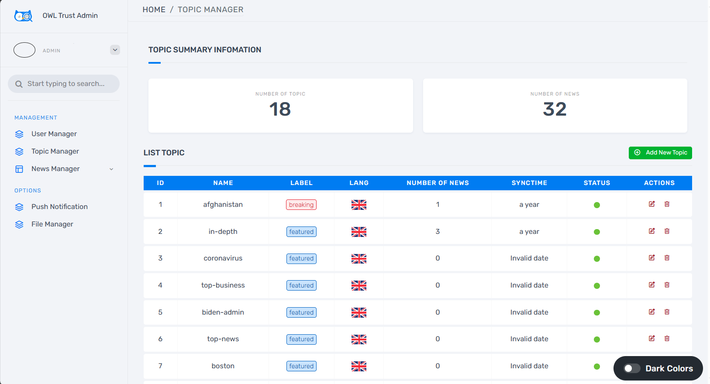

# Fake News Filter - Server

## Overview

The Fake News Filter - Server project is designed to handle the reading, authentication, and logging functionalities related to news articles. The primary focus is on fetching and processing news, allowing users to comment, and ensuring secure authentication.

## Main Features

1. **Reading News:** Fetch and display news articles from various sources.
2. **Comment System:** Enable users to comment on news articles.
3. **Authentication:** Secure user authentication to protect user data and interactions.
4. **Logging:** Implement comprehensive logging for monitoring and debugging purposes.

## Architecture

### Data Model Architecture

The project follows a modular architecture consisting of the following components:

- **Applications:** Core logic and functionality.
- **Data:** Data storage and retrieval, integrating with SQL Server.
- **Utilities:** Common utilities and helper classes.
- **ViewModel:** Structures to represent data for efficient presentation.

### Technology Stack

- **.NET 6.0:** The project is developed using the latest .NET framework for modern and efficient development.
- **SQL Server:** Database management for storing and retrieving data.
- **Quartz:** Job scheduling for periodic tasks.
- **Docker:** Containerization for easy deployment and scalability.

## Project Structure

The project is divided into three main components:

1. **API:** Handles the backend logic and provides an interface for client applications.

- Docker and container management:
  
    

- Swagger Api

    

2. **User App (MVC):** Web application for end-users to interact with news articles, comments, and other features.

    

3. **API App (MVC):** Web application specifically for API interactions, providing a developer-friendly interface.

    

## How to Run

### Prerequisites

- .NET 6.0 SDK
- Docker

### Steps

1. Clone the repository:

```bash
git clone https://github.com/your-username/fake-news-filter-server.git
cd fake-news-filter-server
```

2. Build and run Docker containers:

```bash
docker-compose up --build
```

3. Access the applications:

   - API: <http://localhost:2000>
   - User App (MVC): <http://localhost:2001>
   - API App (MVC): <http://localhost:2002>

4. Import the collections (Optional): `Assert/fakenewsfilter.collection.json`
5. Import full data, open sqlserver import bak(Optional): `Assert/owltrust.bak`
6. Run in local mode(Optional):

```bash
cd FakeNewsFilter.API 
dotnet run
```

- Open new terminal:

```bash
cd FakeNewsFilter.UserApp 
dotnet run
```

## Configuration

- Update configuration files in each application folder for specific settings such as database connection strings, authentication keys, etc.
